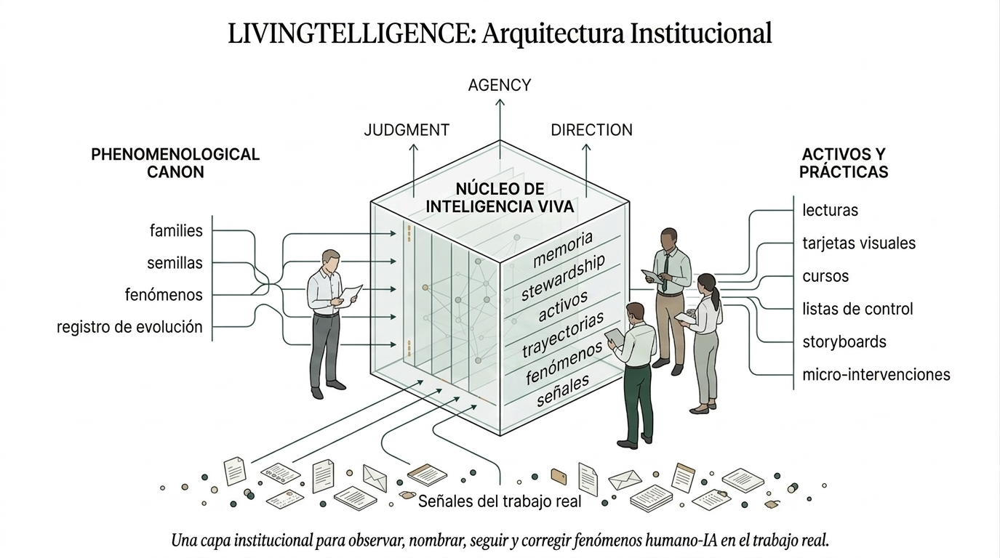

# Custodian

Custodian is a lightweight agentic component within the broader Livingtelligence architecture.

It is designed to support observation, memory, interpretation, follow-up, and longitudinal learning around human-AI phenomena in organizational work.

Custodian is not the whole Livingtelligence system. It is one component in a broader methodology that includes phenomenological observation, Signal Readout, stewardship, consulting practice, education, mitigation assets, and nourishment practices.



## Working Definition

Custodian can be understood as an organizational sensemaking system.

It helps an organization move from dispersed signals to interpreted phenomena, patterns, trajectories, steward review, and adaptive action.

## Purpose

Custodian helps structure the movement from dispersed signals to institutional learning.

Its role is to help teams:

- register signals from real work
- connect signals to possible phenomena
- preserve memory across time
- support steward review
- suggest relevant assets and practices
- make follow-up visible
- maintain continuity between observation and action

## Agentic, Transparent, And Governed

Custodian is designed as an agentic system, but not as an opaque autonomous authority.

Its operation should remain:

- **agentic**: able to assist with structured tasks, interpretation support, routing, memory, and follow-up
- **transparent**: its inputs, outputs, assumptions, and movement across registries should be inspectable
- **guardrailed**: constrained by explicit boundaries, review points, and escalation rules
- **rule-governed**: guided by documented schemas, decision rules, stewardship logic, and human approval where needed
- **steward-facing**: designed to support human judgment, not replace it

The design principle is simple:

> Agents may assist. Stewards decide.

## Working Role

It may support:

- signal intake
- phenomenon mapping
- pattern detection
- trajectory tracking
- organizational memory
- steward-facing interpretation
- asset recommendation
- steward review
- follow-up tasks
- documentation of decisions
- longitudinal learning

## Conceptual Layers

Publicly, Custodian can be described through eight conceptual layers:

```text
Sensing -> Perception -> Patterns -> Trajectories -> Dynamics -> Health -> Insights -> Actions
```

These layers are not presented as a public implementation specification. They describe the sensemaking logic behind Custodian:

- **Sensing**: registering signals from real work
- **Perception**: interpreting signals as possible phenomena
- **Patterns**: identifying relationships and configurations
- **Trajectories**: observing direction over time
- **Dynamics**: understanding intensity and movement in the system
- **Health**: reading organizational capacity and fragility
- **Insights**: producing steward-facing interpretation
- **Actions**: connecting insight to intervention, learning, or follow-up

## Guardrails

Custodian should operate with explicit guardrails.

Examples include:

- no hidden autonomous decision-making
- no unreviewed escalation into high-stakes recommendations
- no use of private data without clear authorization
- no replacement of steward judgment
- no treatment of AI outputs as final authority
- clear distinction between observation, interpretation, recommendation, and decision
- documented movement between registries or states

## Rules And Review

Custodian is intended to work with rules and review processes, not free-form automation alone.

Important design expectations:

- human review remains visible
- assumptions should be traceable
- decisions should be reconstructable
- uncertainty should be named
- recommendations should point to reasons
- sensitive actions require steward approval

## Relationship To Assets

Custodian does not only identify phenomena.

It helps connect phenomena to mitigation and nourishment assets.

Examples:

- a signal of cognitive surrender may point to a judgment-first protocol
- a signal of algorithmic sycophancy may point to adversarial review
- a signal of epistemic warrant collapse may point to a reality checkpoint
- a signal of value interrogation may point to an encoded values diagnostic
- a signal of human-AI mutualism may point to learning and reflection practices

## Public Scope

This folder contains public-facing documentation only.

It does not include:

- private implementation code
- credentials
- internal registries
- client data
- private prompts
- operational configuration
- full Custodian MVP internals

The private Custodian working system remains in the internal Livingtelligence repository.
