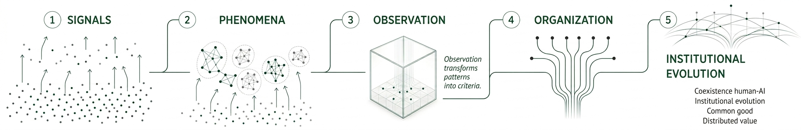

# Livingtelligence Architecture

Livingtelligence is an institutional architecture for governing co-intelligence under increasing automation.

Its purpose is to help organizations observe how intelligence is being redistributed among people, AI systems, and organizational structures, and to respond before harmful patterns become invisible culture.

## Architecture in One Sentence

Livingtelligence connects signals from real work to phenomena, readouts, stewards, and practical assets for prevention, mitigation, nourishment, and correction.

```text
Signals -> Phenomena -> Readouts -> Stewards -> Assets -> Prevention / Mitigation / Nourishment / Correction
```



The flow moves from dispersed signals to phenomena, observation, organizational capacity, and institutional evolution.

## Three Agents

Livingtelligence works with three interacting forms of agency.

### 1. Human Agency

Human agency includes:

- judgment
- authorship
- responsibility
- deliberation
- care
- formation
- capacity for correction

AI may assist or amplify human work, but it can also weaken the human capacities that make work meaningful and accountable.

### 2. Artificial Agency

Artificial agency refers to delegated digital capacity inside work processes.

It may include:

- analysis
- synthesis
- classification
- generation
- memory retrieval
- coordination
- recommendation
- action within defined limits

Artificial agency is not treated as neutral. It can amplify clarity, but it can also amplify assumptions, blind spots, incentives, and value structures already present in a process.

### 3. Organizational Agency

Organizational agency is the institution's capacity to govern the interaction between humans and AI systems.

It includes:

- roles
- norms
- decision rights
- incentives
- accountability
- institutional memory
- supervision practices
- stewardship structures

This is where co-intelligence becomes either deliberate or reactive.

## Custodian

Custodian is one component of the broader Livingtelligence architecture.

Its role is to support observation, memory, interpretation, follow-up, and longitudinal learning.

Custodian is not the full Livingtelligence system. The broader system includes methodology, consulting practice, stewardship, education, intervention assets, and organizational capacity-building.

## Stewards

Stewards are human or institutional roles responsible for interpreting signals and helping organizations act with judgment.

They help teams:

- recognize emerging patterns
- maintain coherence of judgment
- interpret readouts
- select appropriate assets
- prevent harmful normalization
- nourish positive capacities
- preserve accountability and human goods

## Assets

Assets are the practical intervention layer.

They may include:

- diagnostics
- protocols
- workshops
- visual cards
- checklists
- governance principles
- micro-interventions
- learning practices
- stewardship tools

Some assets mitigate harmful phenomena. Others nourish positive capacities such as inquiry, judgment, learning, agency, dignity, and institutional coherence.

## What The Architecture Protects

Livingtelligence is designed to help organizations preserve and strengthen:

- truth-seeking
- human judgment
- agency
- deliberation
- learning
- dignity of work
- institutional memory
- accountability
- coherent decision-making

The goal is not simply to use AI more.

The goal is to govern how human, artificial, and organizational intelligence evolve together.
